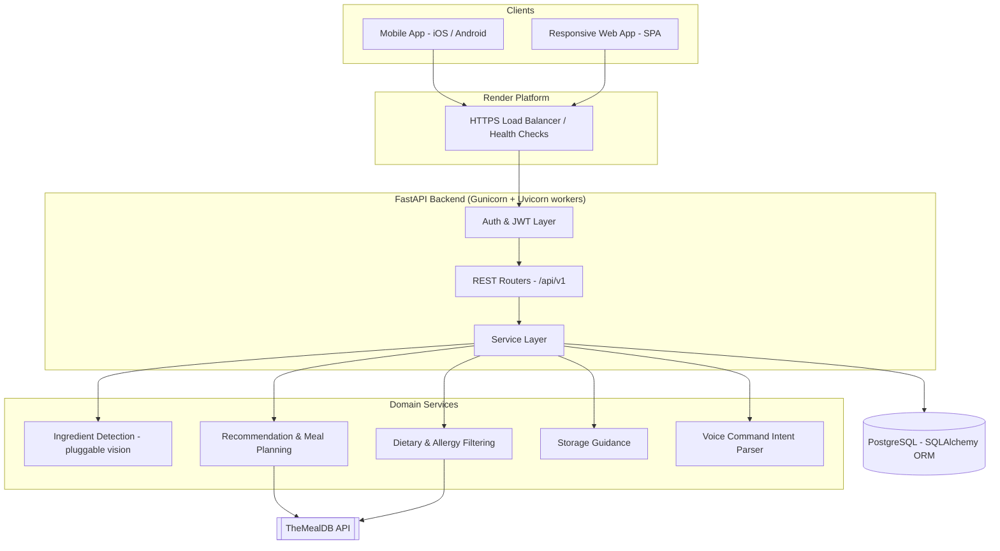

# 3.0 System Requirements and Architecture

The functional and non-functional requirements of the proposed LeftoverLab platform outline the foundational capabilities and quality attributes necessary for its successful implementation.

## 3.1 Proposed System Requirements

### 3.1.1 Functional Requirements

Functional requirements specify what a system should do by defining the specific behaviors, actions, tasks, and operations that a system must perform to satisfy user needs and achieve its goals (Requirements.com, 2024).

The functional requirements for the LeftoverLab platform detail the specific operations and behaviors necessary to achieve its objectives. These include core features such as AI-driven ingredient recognition from photographs, personalized recipe recommendations generated from the user's real-time food inventory, intelligent expiry tracking, and automated meal planning and shopping-list generation. Each requirement is designed to ensure the platform delivers an engaging, user-centric cooking experience while addressing the overarching goals of reducing household food waste, saving money, and lowering the user's carbon footprint. These are outlined in Table 1 below.

#### Table 1. LeftoverLab's system functional requirements.

| ID | Title | Description |
| --- | --- | --- |
| **FR01** | User Registration & Login | The system must allow users to create an account and log in securely (encrypted credentials and token-based sessions) to access personalized features such as recipe recommendations, meal planning, and saved recipes. |
| **FR02** | User Profile Management | Users must be able to view and update personal information, dietary restrictions, food allergies, and account settings so that recommendations can be tailored to them. |
| **FR03** | Image Upload | Users must be able to upload images of groceries or leftovers from their device gallery for ingredient analysis and recognition. |
| **FR04** | Camera Capture | Users must be able to capture ingredient images directly through the device camera for real-time ingredient identification. |
| **FR05** | Ingredient Detection System | The system must automatically recognize and identify ingredients from uploaded or captured images using image-recognition technology. |
| **FR06** | Personalized Recipe Recommendation | The system must recommend recipes tailored to the user's identified ingredients, cooking history, and dietary preferences, drawing on both a local recipe library and the external TheMealDB recipe database. |
| **FR07** | Recipe Filtering System | Users must be able to search and filter recipes by dietary needs, allergies, meal type, cooking time, and budget. |
| **FR08** | Save and Manage Recipes | Users must be able to save favorite recipes, view their saved collection, and manage their personal recipe history. |
| **FR09** | Smart Expiry Tracker | The system must track ingredient expiration dates and alert the user when food is nearing its expiry date. |
| **FR10** | Storage Guidance System | The system must provide recommendations on proper food storage, freezing, reheating, and food safety. |
| **FR11** | Shopping List Generation | The system must automatically generate a shopping list of the ingredients required to prepare selected recipes, excluding items already in the user's inventory. |
| **FR12** | Smart Meal Planner | Users must be able to generate personalized weekly meal plans based on available ingredients, dietary preferences, and ingredient expiry dates. |
| **FR13** | Sustainability Dashboard | The system must display statistics on food-waste reduction, estimated money saved, carbon-footprint reduction, and sustainability achievements. |
| **FR14** | Community Sharing Platform | The system must provide a social platform where users can post recipes, food-saving tips, and cooking experiences, and comment on others' posts. |
| **FR15** | Voice-Controlled Kitchen Mode | The system must provide a hands-free kitchen assistant that lets users use voice commands to navigate recipe steps, repeat instructions, and set cooking timers. |

---

### 3.1.2 Non-Functional Requirements

Non-functional requirements define the quality attributes and performance characteristics that specify how a system is supposed to be (SEBoK, 2024). These include system reliability to ensure consistent operation, scalability to handle growing user demand, robust security measures to protect sensitive dietary and personal data, and high responsiveness for a smooth cooking experience.

These criteria provide a strong foundation for delivering a sustainable and innovative solution that meets both technical standards and user expectations. The detailed requirements are listed in Table 2 below.

#### Table 2. LeftoverLab's system non-functional requirements.

| ID | Title | Description |
| --- | --- | --- |
| **NFR1** | Performance | The system must render ingredient-detection results and recipe suggestions within 5 seconds under normal operating conditions, and must support at least 5,000 concurrent users without performance degradation. |
| **NFR2** | Scalability | The platform must scale horizontally as the number of users, ingredients, and recipes grows. A stateless API layer behind multiple worker processes allows additional instances to be added on demand. |
| **NFR3** | Security | Authentication must use industry-standard measures: passwords hashed with bcrypt and sessions issued as signed JSON Web Tokens (JWT). Enforced password complexity (minimum 8 characters, including an uppercase letter, a number, and a special character) protects user accounts. |
| **NFR4** | Data Privacy | Personal information, passwords, dietary data, and allergy records must never be exposed or shared without explicit permission. All user-scoped data (ingredients, recipes, plans) is access-controlled so a user can only read or modify their own records. |
| **NFR5** | System Availability | The platform must remain highly available so users can access their inventory, recipes, and expiry alerts at any time. A dedicated health-check endpoint and managed hosting support a target of 99.9% uptime. |
| **NFR6** | Usability | The user interface must be simple, intuitive, and accessible. Non-technical users must be able to upload ingredients, view recipes, and manage their food inventory seamlessly across various screen sizes and modern OS versions. |
| **NFR7** | Interoperability | The platform must integrate cleanly with external systems, including the TheMealDB recipe API and a pluggable computer-vision ingredient-recognition service, and must expose a well-documented REST API consumable by both mobile and web clients. |
| **NFR8** | Data Accuracy & Validation | The system must enforce strict data-validation rules to guarantee reliable service: unique prefixed identifiers (e.g., `U001`, `ING001`, `REC001`), valid future expiry dates in `DD/MM/YYYY` format, strictly positive quantities, and enumerated dietary and recipe categories. |

---

## 3.2 Technical Architecture

LeftoverLab follows a layered, service-oriented architecture. Client applications (a cross-platform mobile app and a responsive web app) communicate with a stateless FastAPI backend over a versioned REST API secured with JWT. The backend delegates domain logic to a set of service modules, persists data to a managed PostgreSQL database, and integrates with external providers (TheMealDB for recipes and a pluggable vision service for ingredient detection). The entire backend is containerized and deployed on Render behind a load-balanced set of worker processes.

*(Insert Figure 1: Technical Architecture of LeftoverLab Diagram Here)*

The following diagram summarizes the high-level component interactions:

> **Fig 1.** Technical Architecture of LeftoverLab

**Architectural layers:**

* **Presentation Layer:** A cross-platform mobile application (primary) and a responsive single-page web application (secondary) render the UI, capture images via camera/gallery, and perform on-device speech-to-text for voice mode. Both consume the same REST API.
* **API Layer:** A FastAPI application exposes a versioned REST API (`/api/v1`) with auto-generated OpenAPI/Swagger documentation. It handles routing, request/response validation (Pydantic), authentication (JWT), and CORS. It is stateless, enabling horizontal scaling.
* **Service Layer:** Encapsulated domain logic — ingredient detection, recipe recommendation and meal planning, dietary/allergy filtering, storage guidance, and voice-command interpretation — keeping routers thin and business rules testable in isolation.
* **Data Layer:** A managed PostgreSQL database accessed through the SQLAlchemy 2.0 ORM, with atomic generation of human-readable prefixed identifiers and schema initialization protected by advisory locks for safe multi-worker startup.
* **Integration Layer:** Outbound integrations with TheMealDB (real recipe generation from inventory) and a pluggable computer-vision provider for ingredient recognition, isolated behind service interfaces so implementations can be swapped without affecting the rest of the system.

---

## 3.3 Platform and Technology Stack

### 3.3.1 Platform

The primary platform is a mobile application for both iOS and Android, complemented by a responsive web application for desktop and browser access. The choice of platform is guided by the following considerations:

* **Accessibility & Immediate Engagement:** The core functions of Image Upload, Camera Capture, and Ingredient Detection rely on modern smartphone camera interfaces, which provide the most natural and immediate way for users to log their groceries and leftovers wherever they are — in the kitchen, at the store, or in front of the fridge.
* **Cross-Platform Reach:** Targeting Android and iOS from a single codebase (via a cross-platform framework such as React Native or Flutter) maximizes reach while keeping development and maintenance efficient. A responsive web client ensures users without the app can still access their inventory and recipes.
* **Backend Infrastructure:** LeftoverLab is powered by a Python FastAPI backend with a managed PostgreSQL database, deployed on Render for reliable hosting, automatic HTTPS, health checks, and continuous deployment from source control.
* **Agile Evolution:** A decoupled client/server design allows the backend and clients to evolve independently; server-side improvements (e.g., a better recognition model or new recommendation logic) ship without requiring an app-store update.

### 3.3.2 Technology Stack

* **Backend Framework:** The server is built with **FastAPI** (Python), chosen for its high performance, native asynchronous support (important for concurrent calls to external services such as TheMealDB), and automatic OpenAPI documentation. In production it runs under **Gunicorn** with **Uvicorn** ASGI workers.
* **Database & Data Modeling:** **PostgreSQL** serves as the primary datastore, accessed through the **SQLAlchemy 2.0** ORM. **Pydantic v2** provides strict request/response validation and enforces the platform's data rules (prefixed IDs, enumerated dietary preferences and recipe categories, future-dated expiry, positive quantities).
* **Authentication & Security:** User sessions are secured with **JSON Web Tokens (JWT)** issued via **python-jose**, and passwords are hashed with **bcrypt** through **passlib**. An OAuth2 password flow governs login and protected endpoints.
* **Recipe Data & Personalization:** The **TheMealDB API** supplies a large catalogue of real recipes; an asynchronous **httpx** client filters meals by the user's inventory, scores them by ingredient coverage, and passes them through a dedicated **dietary and allergy filtering** module (supporting Vegetarian, Vegan, Halal, Gluten-Free preferences and expandable allergen matching) before returning safe recommendations.
* **Computer Vision (Ingredient Detection):** Ingredient recognition is implemented behind a pluggable service interface, allowing a real vision model — a hosted image classifier, a cloud service such as AWS Rekognition, a custom TensorFlow/PyTorch model, or a multimodal LLM — to be integrated without changes elsewhere in the system.
* **Voice Assistant:** Voice-controlled kitchen mode uses on-device speech-to-text on mobile (and the browser Web Speech API on the web client) for transcription, while a backend intent parser resolves commands (next/previous step, repeat, read ingredients, set timer) into structured actions.
* **Front-End Development & Design:** The web client is a lightweight, responsive single-page application (HTML/CSS/JavaScript) following clean, intuitive design principles; the recommended mobile stack is **React Native** with a **Material Design**-based component system for a consistent cross-platform experience.
* **API Design:** The platform exposes versioned **RESTful APIs** documented via **OpenAPI/Swagger**, enabling both first-party clients and potential third-party integrations to consume the service in a predictable, self-describing manner.
* **Deployment & DevOps:** The application is deployed on **Render** using an infrastructure-as-code **Blueprint** (`render.yaml`) that provisions the web service and managed PostgreSQL database and injects configuration securely. A **Dockerfile** provides an alternative containerized build, and automated tests run with **pytest**.

---

## 3.4 Development Methodology

LeftoverLab is developed using the **Agile/Scrum** methodology, which emphasizes iterative development and continuous improvement through structured sprints and cross-functional collaboration. Development is organized into focused two-week sprints, prioritizing features based on user feedback, setting clear sprint goals, breaking work into manageable units, and allocating resources effectively across the team.

* **Sprint Workflow:** Each iteration begins with sprint planning and daily stand-up meetings to share progress and surface blockers. Regular code reviews and automated testing maintain high coding standards, supported by a continuous integration and continuous deployment (CI/CD) pipeline — every change pushed to the main branch triggers an automatic redeploy on Render.
* **Cross-Functional Team Structure:** Work proceeds in parallel across specialized roles:
  * **UI/UX Designers:** Focus on intuitive, accessible interfaces for logging ingredients and browsing recipes.
  * **Frontend Developers:** Implement the mobile (React Native) and web clients.
  * **Backend Developers:** Build the FastAPI services, database models, and external integrations (TheMealDB, vision service).
  * **QA Engineers:** Ensure thorough automated and manual testing of features.
* **Quality Assurance Framework:** Quality assurance is multilayered — unit tests for domain logic (e.g., dietary/allergy filtering and data validation), integration tests for API endpoints, user acceptance testing (UAT) for new features, ongoing performance monitoring against the 5-second response target, and periodic security reviews to protect user data and maintain platform integrity.

This methodology allows LeftoverLab to remain agile — responding quickly to user feedback and sustainability goals — while maintaining high standards of quality, security, and reliability.
